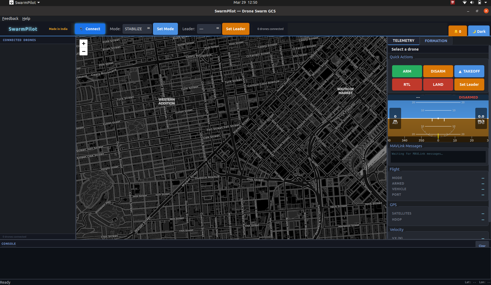
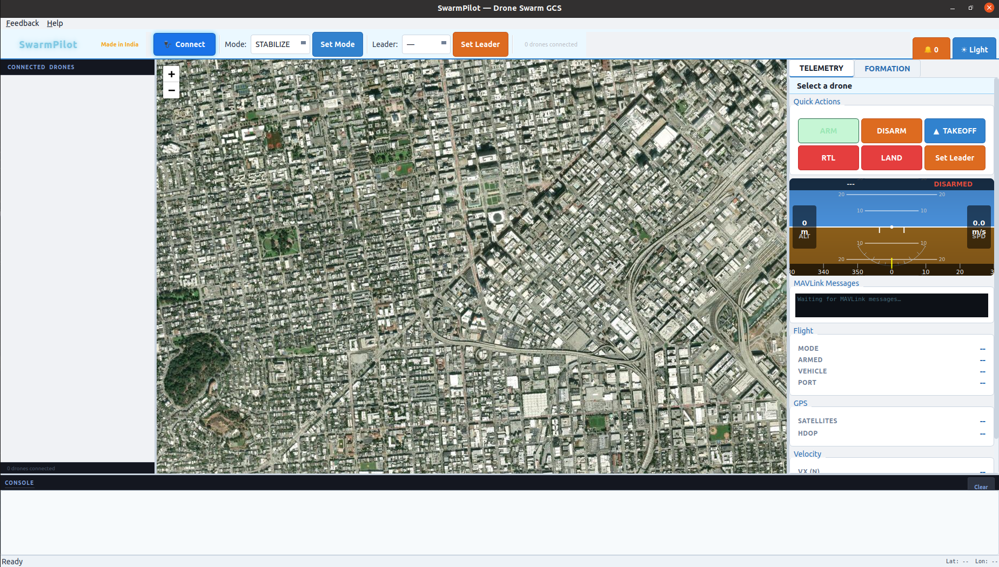
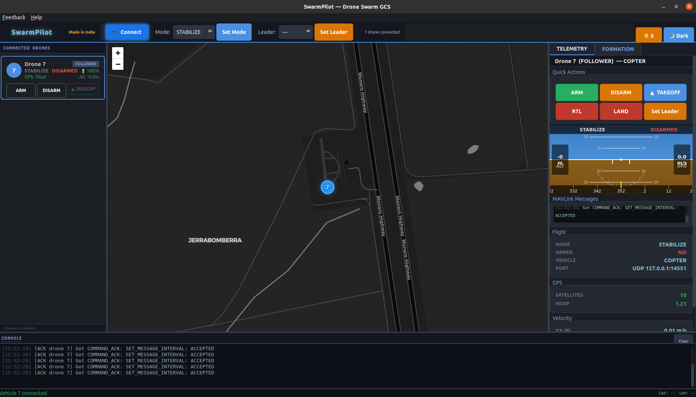
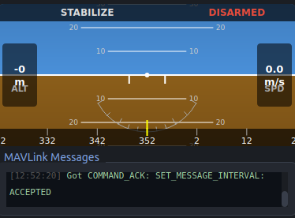
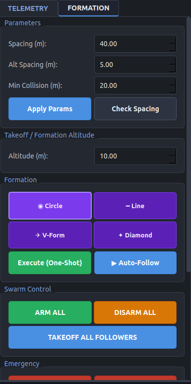
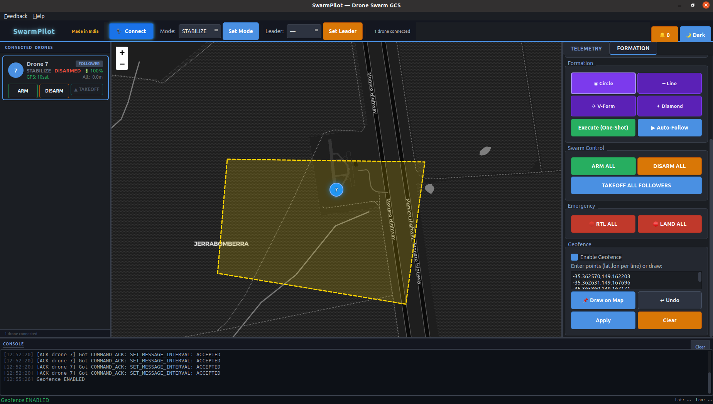
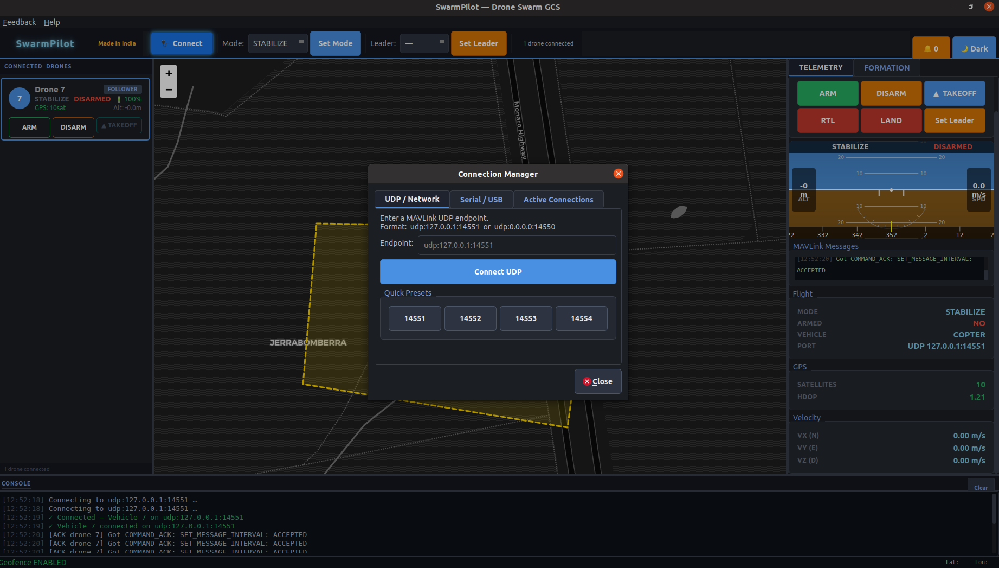
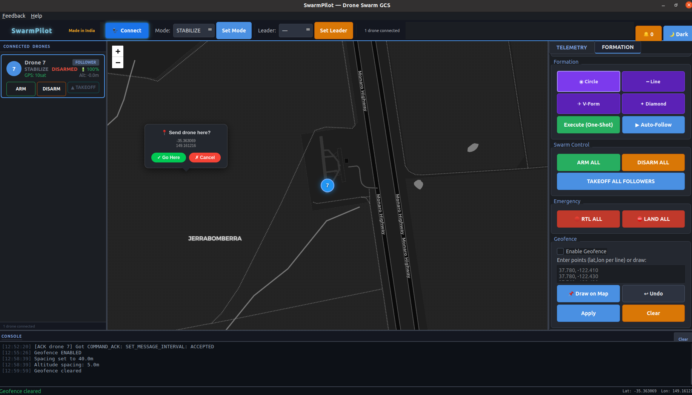
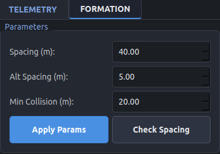

<p align="center">
  
</p>

<h1 align="center">SwarmPilot™</h1>

<p align="center">
  Multi-UAV Ground Control Station for ArduCopter
</p>

<p align="center">
  
  
  
  
</p>

<p align="center">
  <a href="https://swarmpilot.co.in">swarmpilot.co.in</a>
</p>

---

SwarmPilot™ is a multi-drone ground control station that lets you command up to 4 ArduCopter drones in synchronized formations. It handles real-time telemetry, automated formation flying, collision monitoring, and geofencing from a single workstation.

Communication runs over MAVLink 2.0 through Serial/USB or UDP connections. The swarm operates on a leader–follower architecture where one drone holds position in LOITER while the rest follow in GUIDED mode.

|  |  |
|--|--|
| Swarm size | Up to 4 drones |
| Telemetry polling | 100 Hz |
| Formation updates | 5 Hz |
| Collision checks | 10 Hz |
| HUD refresh | 60 Hz |
| Protocol | MAVLink 2.0 |

---

## Contents

- [Screenshots](#screenshots)
- [Downloads](#downloads)
- [System Requirements](#system-requirements)
- [Drone Preparation](#drone-preparation)
- [Getting Started](#getting-started)
- [Interface Guide](#interface-guide)
- [Connecting Drones](#connecting-drones)
- [Formations](#formations)
- [Collision Detection](#collision-detection)
- [Geofencing](#geofencing)
- [HUD & Telemetry](#hud--telemetry)
- [Map](#map)
- [Keyboard Shortcuts](#keyboard-shortcuts)
- [Privacy](#privacy)
- [Firmware Compatibility](#firmware-compatibility)
- [Limitations](#limitations)
- [Roadmap](#roadmap)
- [Troubleshooting](#troubleshooting)
- [License](#license)

---

## Screenshots

### Dark Theme


### Light Theme


### Telemetry Panel


### HUD


### Formation Panel


### Geofence


### Connection Manager


### Map — Send Drone to Location


### Collision / Spacing Parameters


---

## Downloads

Get the latest release from [swarmpilot.co.in](https://swarmpilot.co.in) or the GitHub Releases page.

### Windows

1. Download **SwarmPilot-Windows.zip**
2. Extract to any folder
3. Run **SwarmPilot.exe**

### Linux

1. Download **SwarmPilot-x86_64.AppImage**
2. Make it executable:
   ```
   chmod +x SwarmPilot-x86_64.AppImage
   ```
3. Run it:
   ```
   ./SwarmPilot-x86_64.AppImage
   ```

The AppImage is fully self-contained — no dependencies or installation required. It runs on any x86_64 Linux distribution (Ubuntu 18.04+, Fedora, Arch, etc.).

---

## System Requirements

| Component | Minimum | Recommended |
|-----------|---------|-------------|
| OS | Windows 10 / Ubuntu 18.04 | Windows 11 / Ubuntu 22.04 |
| CPU | Dual-core 1.5 GHz | Quad-core 2.5 GHz+ |
| RAM | 2 GB | 4 GB+ |
| Disk | 500 MB | 1 GB |
| Display | 1280×720 | 1920×1080+ |
| Network | — | Low-latency link for UDP telemetry |

---

## Drone Preparation

Before connecting drones to SwarmPilot, each flight controller in the swarm **must be configured with a unique MAVLink System ID**. SwarmPilot uses the System ID to distinguish between individual drones — if two drones share the same ID, they will collide in the software and only one will be recognized.

### Setting the System ID

In ArduCopter, the System ID is controlled by the `SYSID_THISMAV` parameter.

**Using Mission Planner:**

1. Connect to the flight controller
2. Go to **Config → Full Parameter List**
3. Find `SYSID_THISMAV`
4. Set a unique value for each drone (e.g., 1, 2, 3, 4)
5. Click **Write Params**
6. Reboot the flight controller

**Using MAVProxy:**

```
param set SYSID_THISMAV 1
```

Repeat for each drone with a different value.

### Recommended ID Scheme

| Drone | SYSID_THISMAV | Role |
|-------|---------------|------|
| Drone 1 | 1 | Leader |
| Drone 2 | 2 | Follower |
| Drone 3 | 3 | Follower |
| Drone 4 | 4 | Follower |

You can use any value from 1–255, but sequential IDs starting from 1 keep things clean. The leader role is assigned in SwarmPilot's UI, not by the System ID itself — any drone can be designated as leader.

### Additional Firmware Requirements

- **Firmware:** ArduCopter (multi-rotor only)
- **MAVLink output:** Must be enabled on the telemetry port (serial or UDP)
- **GPS:** Required for formation flying and geofencing. A minimum of 6 satellites is recommended for reliable positioning.
- **Flight modes:** The drone must support LOITER and GUIDED modes. Ensure these are available in your mode switch configuration.

---

## Getting Started

### 1. Prepare your drones

Make sure each ArduCopter flight controller has a unique `SYSID_THISMAV` value set (see [Drone Preparation](#drone-preparation)). Verify that telemetry output is enabled on the intended port.

### 2. Launch SwarmPilot

Run `SwarmPilot.exe` on Windows or `./SwarmPilot-x86_64.AppImage` on Linux.

### 3. Connect

Click **🔌 Connect** in the toolbar (or press `Ctrl+N`). Choose UDP or Serial, enter the connection details, and connect each drone one at a time.


### 4. Assign a leader

From the **Leader Selector** dropdown in the toolbar, pick a drone and click **Set Leader**. The leader switches to LOITER mode; all followers switch to GUIDED.

### 5. Fly a formation

Open the **Formation** tab on the right panel. Select a pattern (Circle, Line, V, or Diamond), set your spacing, and click **Execute** or toggle **Auto-Follow** for continuous tracking.

### 6. Emergency controls

| Action | Button | Shortcut |
|--------|--------|----------|
| Return all drones to launch | 🔴 **RTL ALL** | `Ctrl+R` |
| Land all drones immediately | ⛔ **LAND ALL** | `Ctrl+L` |

---

## Interface Guide

```
┌─ TOOLBAR ─────────────────────────────────────────────────────────┐
│ SwarmPilot │ 🔌 Connect │ Mode ▾ │ Set Mode │ Leader ▾          │
│            │             │ Swarm Info        │ Alerts  │ 🌙 Theme│
├────────────┼─────────────────────┼─────────────────────────────────┤
│            │                     │                                 │
│  DRONE     │    MAP              │  TELEMETRY / FORMATION TABS     │
│  LIST      │                     │                                 │
│            │                     │  Telemetry:                     │
│  ┌──────┐  │   ● Drone 1 (L)    │    HUD, flight data, GPS,       │
│  │ D1 L │  │   ● Drone 2        │    battery, MAVLink messages     │
│  │ D2   │  │   ● Drone 3        │                                 │
│  │ D3   │  │                     │  Formation:                     │
│  └──────┘  │                     │    Type, spacing, geofence,     │
│            │                     │    swarm controls                │
├────────────┴─────────────────────┴─────────────────────────────────┤
│ LOG CONSOLE                                                        │
└────────────────────────────────────────────────────────────────────┘
```

### Toolbar

| Control | What it does |
|---------|-------------|
| **SwarmPilot** | Opens [swarmpilot.co.in](https://swarmpilot.co.in) |
| **🔌 Connect** | Opens connection manager (`Ctrl+N`) |
| **Mode Selector** | Pick a flight mode (STABILIZE, LOITER, GUIDED, LAND, RTL…) |
| **Set Mode** | Apply selected mode to the focused drone |
| **Leader Selector** | Choose which drone is the swarm leader |
| **Alert Badge** | Shows number of unseen collision/geofence alerts |
| **🌙/☀️** | Toggle dark/light theme |

### Drone List (Left Panel)

Each connected drone gets a card showing:


- Status badge — Amber (Leader), Green (Armed), Blue (Disarmed)
- Flight mode and armed state
- Battery percentage
- GPS satellite count and altitude
- ARM / DISARM / TAKEOFF buttons

Drones that lose connection blink red.

### Menu

| Menu | Item |
|------|------|
| Feedback | Suggest a Feature / Report a Problem |
| Help | About SwarmPilot |

---

## Connecting Drones

Press `Ctrl+N` or click **🔌 Connect** to open the connection manager.

### UDP Connections

For WiFi telemetry, companion computers, or network bridges.

```
udp:<IP>:<PORT>

Examples:
  udp:192.168.1.100:14550   ← Drone on local network
  udp:0.0.0.0:14550         ← Listen on all interfaces
```

Quick-connect buttons are available for ports 14551–14554.

### Serial / USB Connections

For SiK telemetry radios or direct USB to the flight controller.

| Platform | Format | Example |
|----------|--------|---------|
| Windows | COMx | COM3 |
| Linux | /dev/ttyUSBx | /dev/ttyUSB0 |

Default baud rate: **115200**. Other supported rates: 9600, 19200, 38400, 57600, 230400, 460800, 921600.

### Managing Connections

The **Active Connections** tab lists all connected drones. Select one and click **Disconnect Selected** to remove it from the swarm.

### Protocol Reference

| Parameter | Value |
|-----------|-------|
| GCS System ID | 255 |
| GCS Component ID | 250 |
| Heartbeat interval | 1 s |
| Connection timeout | 5 s |
| Heartbeat wait | 15 s |

---

## Formations

SwarmPilot uses a leader–follower model. The leader holds position in LOITER while followers receive `SET_POSITION_TARGET_GLOBAL_INT` commands in GUIDED mode.


### Circle

```
        ● F2
       / \
      /   \
  F3 ●  L  ● F1
      \   /
       \ /
        ● F4
```

Followers spread at equal angles around the leader at `spacing_dist` radius.

### Line

```
  L ──── F1 ──── F2 ──── F3
```

Followers trail behind the leader. Distance = `spacing_dist` × (index + 1).

### V-Formation

```
          L
         / \
        /   \
      F1     F2
      /       \
    F3         F4
```

Asymmetric V with relative bearings at ±45°, ±90°, ±135°.

### Diamond

```
        F1
       / \
      /   \
    F3  L  F2
      \   /
       \ /
        F4
```

Four-point pattern with varying distances and bearings.

### Parameters

| Setting | Default | Range |
|---------|---------|-------|
| Spacing distance | 40 m | 5–1000 m |
| Altitude spacing | 5 m | 1–100 m |
| Min collision distance | 20 m | 1–500 m |

Followers are stacked vertically: `leader_alt + (altitude_spacing × follower_index)`.

### Execution Modes

| Mode | Behaviour |
|------|-----------|
| **Execute (One-Shot)** | Single formation command; followers hold position |
| **▶ Auto-Follow** | Continuous 5 Hz updates; followers track the leader in real-time |

---

## Collision Detection

A dedicated safety monitor runs at 10 Hz, checking every pair of armed drones with valid GPS.


| Level | Threshold | Response |
|-------|-----------|----------|
| CLEAR | ≥ 44 m (2.2× min) | Normal |
| WARNING | ≤ 32 m (1.6× min) | Alert shown — operator should act |
| CRITICAL | ≤ 20 m (1.0× min) | Urgent alert — immediate action needed |

Alerts are rate-limited to 1 per 3 seconds per drone pair.

When horizontal distance drops below 1.5× the warning threshold, vertical separation is also checked. An alert fires if the altitude difference is less than half the altitude spacing (default: 2.5 m).

SwarmPilot does **not** auto-override flight modes on collision. The operator is responsible for taking action (RTL, LAND, or increasing spacing).

---

## Geofencing

Draw a polygon boundary on the map. Any drone that crosses it gets an automatic **RTL** command.


**To draw a geofence:**

1. Open the **Formation** tab → enable **Geofence**
2. Click **📌 Draw on Map**
3. Click on the map to place vertices
4. Right-click to close the polygon
5. Click **Apply**

You can also enter coordinates manually (one `lat, lon` per line in the text area).

| Detail | Value |
|--------|-------|
| Check rate | 4 Hz |
| Breach action | RTL (rate-limited per drone) |
| **↩ Undo** | Removes last drawn point |
| **Clear** | Removes the geofence |

---

## HUD & Telemetry

### Artificial Horizon

The HUD renders at 60 Hz with smooth pitch/roll interpolation.


| Element | Description |
|---------|-------------|
| Sky/Ground | Blue-brown split, rotates with pitch and roll |
| Pitch ladder | ±30° in 10° steps |
| Roll arc | Tick marks at ±10°, 20°, 30°, 45°, 60° |
| Heading tape | 60° span with yellow chevron marker |
| Altitude / Speed | Left and right readout strips |
| Mode badge | Flight mode + armed/disarmed state (green/red) |

A disconnected drone shows **DISCONNECTED** in red across the HUD.

### Telemetry Panel

| Data | Source |
|------|--------|
| Flight mode, armed state, vehicle type | HEARTBEAT |
| GPS satellites (green ≥6, amber ≥3, red <3) | GLOBAL_POSITION_INT |
| HDOP | GPS raw |
| Velocity (Vx, Vy, Vz) | NED frame, m/s |
| Battery voltage, current, % | BATTERY_STATUS |

The panel also shows a scrolling MAVLink message log (last 60 messages, colour-coded by severity).

---

## Map

Built on Leaflet.js with two tile layers:

| Theme | Tiles |
|-------|-------|
| Dark | CARTO dark basemap |
| Light | ArcGIS World Imagery |


| Action | Result |
|--------|--------|
| Click | Show coordinates |
| Double-click | Send leader to that location (with confirmation) |
| Hover marker | Drone info tooltip |
| Click marker | Select drone |

Drone markers are colour-coded with system ID labels. The leader has a glow effect.

---

## Keyboard Shortcuts

| Shortcut | Action |
|----------|--------|
| `Ctrl+N` | Open connection manager |
| `Ctrl+R` | RTL ALL |
| `Ctrl+L` | LAND ALL |
| `F1` | Select Drone 1 |

---

## Privacy

SwarmPilot collects anonymous usage analytics (Google Analytics 4) to help improve the product. No personal data or flight data is ever collected.

**Collected:** OS type, screen size, RAM tier, app events (start, arm, formation change).

**Never collected:** drone GPS data, flight paths, operator location, serial numbers, or any PII.

Events queue locally and batch-send when online. To disable analytics entirely:

```
# Linux
SWARM_NO_ANALYTICS=1 ./SwarmPilot-x86_64.AppImage

# Windows (PowerShell)
$env:SWARM_NO_ANALYTICS = "1"; .\SwarmPilot.exe

# Windows (CMD)
set SWARM_NO_ANALYTICS=1 && SwarmPilot.exe
```

---

## Firmware Compatibility

| Firmware | Status |
|----------|--------|
| **ArduCopter** | Supported |
| ArduPlane | Not yet supported |
| ArduRover | Not yet supported |
| PX4 | Planned (v3.0) |
| INAV | Planned (v3.0) |

### Supported Flight Controllers

Any MAVLink-compatible FC running ArduCopter — Pixhawk series, Cube, Kakute, Matek H743, Holybro Durandal, and others.

### Telemetry Links

| Link | Type |
|------|------|
| SiK 433/915 MHz radio | Serial |
| ESP8266/ESP32 bridge | UDP |
| Direct USB | Serial |
| Companion computer (RPi, Jetson) | UDP |

---

## Limitations

- Maximum of 4 drones per swarm
- ArduCopter only — no plane, rover, or VTOL support yet
- 2D map (no 3D terrain)
- No FPV video streaming — telemetry and HUD only
- Collision alerts require manual response (no auto-override)
- Formation control only — no pre-planned waypoint missions
- One MAVLink connection per drone (no link redundancy)

---

## Roadmap

| Version | Feature |
|---------|---------|
| v1.2 | 3D Maps & Terrain |
| v1.5 | Unified Swarm Controller |
| v2.0 | AI-Assisted Fallback Systems |
| v2.2 | Live Video Streaming |
| v2.5 | Full ArduPilot Vehicle Support |
| v3.0 | PX4 & INAV Support |

---

## Troubleshooting

**Can't connect via UDP**
- Confirm the drone is broadcasting MAVLink on the expected port
- Open UDP ports 14550–14554 in your firewall
- Try `udp:0.0.0.0:14550` to listen on all interfaces

**Serial port not showing up**
- Check that the USB cable is connected and drivers are installed
- On Linux: add yourself to the `dialout` group — `sudo usermod -a -G dialout $USER`, then log out and back in
- Hit **Refresh** in the connection dialog

**Map tiles not loading**
- An internet connection is required for map tiles
- If behind a proxy, make sure HTTPS traffic to CDN hosts is allowed

**Drones not appearing as separate vehicles**
- Each flight controller must have a **unique** `SYSID_THISMAV` value. If two drones share the same System ID, SwarmPilot treats them as one vehicle. See [Drone Preparation](#drone-preparation).

**"Only ArduCopter vehicles are supported"**
- SwarmPilot v1.1.0 works with multi-rotor drones running ArduCopter firmware only. Other vehicle types are on the roadmap.

**AppImage won't launch (Linux)**
- Install FUSE: `sudo apt install libfuse2`
- Make sure the file is executable: `chmod +x SwarmPilot-x86_64.AppImage`

---

## License

SwarmPilot™ is proprietary software. All rights reserved.
Unauthorized redistribution, modification, or reverse engineering is prohibited.

© SwarmPilot · [swarmpilot.co.in](https://swarmpilot.co.in)

<p align="center">
  Made in India 🇮🇳
</p>
